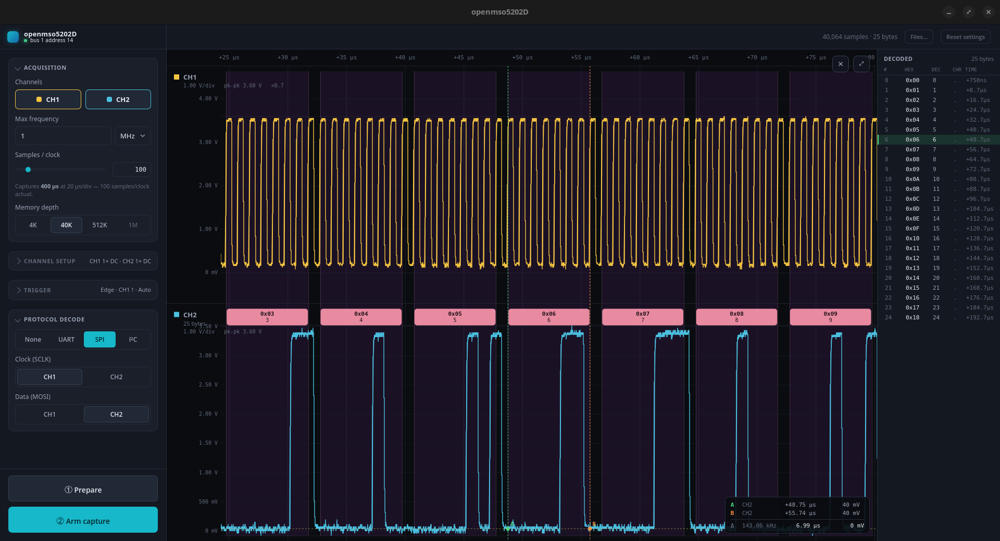
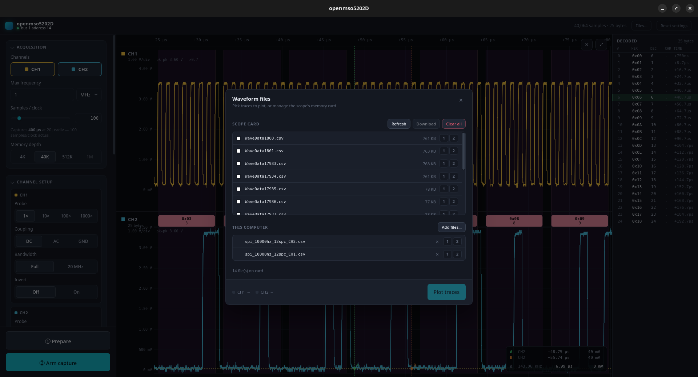

# openmso5202D

An open driver + desktop GUI for the **Hantek MSO5202D** oscilloscope (USB `049f:505a`),
reverse-engineered from USB captures of the vendor Windows app.

> [!IMPORTANT]
> **A USB flash drive must be plugged into the scope's front-panel USB port.** Every capture
> is routed through the scope's own Save-to-CSV export, which writes to that drive and is read
> back over USB. With no drive mounted the save is a silent no-op and the app gets no data.

> [!NOTE]
> **Tested against a single unit only:** the **200 MHz** MSO5202D variant, firmware
> **3.2.35 (180502.0)**, hardware **1020x55778344** (from the scope's Utility → System Status).
> Other firmware revisions, or the lower-bandwidth MSO5000-series models, may behave
> differently — the protocol was reverse-engineered, not documented by the vendor.



A **triggered capture-and-decode workbench** — not a live scope face. You arm the scope, it
records one trigger-aligned snapshot into deep memory, and the app reads it back over USB to plot
and decode. With it you can:

- **Capture deep records** — up to **1M samples**, far past the 3,840 the scope serves over USB.
- **Decode serial buses** — UART, SPI and I²C, every byte shown as a pill on the trace and in a list.
- **Read the waveform** — pan, zoom, and drop measurement cursors.
- **Work offline** — reopen and re-decode any saved capture with no scope attached.

## Prerequisites

- **Rust** (stable) with `cargo`
- **Node** + **pnpm**
- **libusb 1.0** (`libusb-1.0-0-dev`)
- **Tauri Linux deps**: `webkit2gtk-4.1`, `libgtk-3-dev`, plus the usual
  `build-essential`/`libssl-dev` (see the [Tauri prerequisites](https://tauri.app/start/prerequisites/))
- **USB access**: install the udev rule so the scope is reachable without root:
  ```sh
  sudo cp 70-mso5202d.rules /etc/udev/rules.d/
  sudo udevadm control --reload-rules && sudo udevadm trigger
  # then replug the scope
  ```
  Otherwise run the app/playground as root.

## Build & run

The project has **two stages**, driven from the repo root:

### 1. Bootstrap (once, and after dependency changes)

```sh
pnpm bootstrap
```

Installs the JS dependencies (`pnpm install`) and pre-fetches the Rust crates
(`cargo fetch`).

### 2. Build the standalone app

```sh
pnpm build
```

This is the release build — it type-checks and bundles the frontend, compiles the Rust backend
optimized, and packages everything into a **self-contained desktop app**. No `pnpm`, Node or
Vite is involved once it is built; the web assets are embedded in the binary.

It produces, under `target/release/`:

| Output | Path |
| --- | --- |
| Plain executable | `target/release/openmso5202d` |
| Debian package | `target/release/bundle/deb/openmso5202D_0.1.0_amd64.deb` |
| RPM package | `target/release/bundle/rpm/openmso5202D-0.1.0-1.x86_64.rpm` |
| AppImage (portable) | `target/release/bundle/appimage/openmso5202D_0.1.0_amd64.AppImage` |

Pick whichever suits you:

```sh
./target/release/openmso5202d                        # run it straight from the build
sudo apt install ./target/release/bundle/deb/*.deb   # install system-wide → app menu entry
chmod +x target/release/bundle/appimage/*.AppImage   # portable, copy it anywhere
```

Installing the `.deb`/`.rpm` registers `openmso5202D` as a normal desktop application, so it
appears in the launcher and can be started like any other program. **It also installs the
udev rule** (to `/usr/lib/udev/rules.d/`) and reloads udev, so the scope is reachable without
root — replug it after installing. The AppImage needs no install at all — a single file you
can move to another machine of the same architecture — but it carries no udev rule, so
install that yourself as in the prerequisites.

Building only the executable (skipping the installer bundles) is faster:

```sh
pnpm --filter openmso5202d-frontend tauri build --no-bundle
```

Running the plain executable or the AppImage still needs the udev rule from the prerequisites
— without it the app cannot open the scope unless started as root.

### Develop

```sh
pnpm dev          # hot-reloading Tauri dev app (Vite dev server + the Rust backend)
```

## Using the app

Press **Connect** in the top-left to open the scope over USB. The badge under the title then
shows the bus and address it found; until it is connected, the capture buttons stay disabled.
If Connect fails, the scope is either unplugged or the udev rule is not installed (see the
prerequisites above).

### 1. Set up the acquisition

The left sidebar is the whole setup, in four foldable sections. Each one shows a summary of
its current state while collapsed, so nothing is hidden.

- **Acquisition** — which channels to record (CH1, CH2 or both), the **max frequency** of the
  signal you expect and how many **samples per clock** you want of it, and the **memory
  depth** (4K / 40K / 512K / 1M).

  Frequency and samples-per-clock are how you pick a timebase: the app works out the SEC/DIV
  the scope needs, snaps it to the instrument's fixed ladder, and tells you what you actually
  get — *"Captures 400 µs at 20 µs/div — 100 samples/clock actual"*. If the ADC cannot sample
  that fast the hint says so. Deeper memory at the same timebase means the same time window
  with more samples; to record a *longer* stretch, lower the max frequency.

  1M is single-channel only, and picking a second channel drops it to 512K automatically.
- **Channel setup** — probe attenuation (1× / 10× / 100× / 1000×), coupling (DC / AC / GND),
  bandwidth (Full / 20 MHz) and invert, per channel. Probe attenuation matters: it scales both
  the volts on screen and the trigger level.
- **Trigger** — trigger type (Edge, Pulse, Video, Slope, Overtime, Alter), source, slope,
  coupling, mode and level. The level is entered in volts.
- **Protocol decode** — **None**, **UART**, **SPI** or **I²C**, plus which physical channel
  carries each line. UART needs one channel (data); SPI needs clock + data, I²C needs SCL +
  SDA, so both channels must be on. Assigning a line to the channel the other line is on swaps
  them.

  Decode settings are *not* part of the acquisition — changing the protocol or a line
  assignment re-decodes the record already on screen instantly, with no new capture.

Every setting is remembered between runs. **Reset settings** in the top bar puts them all
back to their defaults.

### 2. Capture

Two buttons, in order:

1. **① Prepare** — applies your whole sidebar configuration to the scope. Takes a few seconds;
   run it once. Changing any acquisition setting greys out step ② until you prepare again.
2. **② Arm capture** — waits for the trigger and reads the record back. Re-pressable: each
   press gives a fresh record with the same setup.

The top bar shows progress for each phase and holds any error until you dismiss it.

### 3. Read the record

The plot shows one lane per channel, with its V/div, pk-pk and probe factor in the corner.

- **Scroll wheel** — pan through the record sideways.
- **Left-drag** — pan; **right-drag** — zoom (sideways scales time, up/down scales the
  voltage axis of the lane under the pointer).
- **Click** — drop a measurement cursor on the trace. Cursors read out their time and voltage,
  plus the Δt, ΔV and implied frequency between them. Drag a cursor's dot to move it, and use
  the **×** button to clear them all.
- **⤢** — fit the whole record back into view.

With a protocol selected, each decoded byte is drawn as a pill over the stretch of waveform it
was read from, with faint byte-boundary guides. The **Decoded** list on the right gives every
byte as hex, decimal, character and timestamp; clicking a row zooms the plot to that byte and
brackets it with cursors, and moving a cursor highlights whichever byte it lands on.

### Files



**Files…** in the top bar opens the waveform library. Captures are exported by the scope as
`WaveData*.csv` onto the front-panel USB drive, and this dialog is how you manage them:

- **Scope card** — list what is on the drive, **Download** the ticked files to this computer,
  or **Clear all** to delete every `WaveData` CSV (irreversible; it uses the scope's own
  delete softkey, never a shell `rm`).
- **This computer** — **Add files…** brings any saved CSVs into the library.

Assign a file to **1** or **2** to load it as that channel and press **Plot traces** to view
and decode it. This works with **no scope connected**, so an old capture can be re-read and
re-decoded offline.

### Requirements & caveats

- **Every** capture routes through the scope's front-panel **USB flash drive** —
  it must be plugged in and mounted, or the save is a silent no-op and no record comes back.
- The 16-channel **logic analyser pod cannot be read live over USB** (the firmware path is
  broken and corrupts the scope's own display). LA data is only available through a saved CSV,
  and enabling the pod clamps memory depth to 4K.
- A deep save is slow: a 512K record is a ~7.7 MB file and takes the scope tens of seconds to
  write before it can be read back.

## Documentation

The full reverse-engineering record and the developer guides live in `docs/`.

| Document | What it covers |
| --- | --- |
| [Wire protocol](docs/MSO5202D-protocol.md) | The authoritative, self-contained byte-level spec of the USB protocol: framing, every selector, the 213-byte settings block field by field, key ids, and the shell channel. Written to survive the loss of every other file here. |
| [State machines & flows](docs/MSO5202D-statemachines.md) | How to *drive* the scope: connection, the prepare/capture sequences, the menu maps, the waits, the failure/recovery table, and the host-side USB transport rules. The procedural companion to the wire spec. |
| [Rendering model](docs/MSO5202D-rendering.md) | How samples become a trace: the two sample sources, the signed-int8 byte decode, the volts and time axes, and the decoded-byte overlay. |
| [Backend guide](docs/backend.md) | Developer guide to the `mso5202d` Rust crate: its four layers, every module, the main call chains, the binaries, and the tests. |
| [Frontend guide](docs/frontend.md) | Developer guide to the Tauri + React app: the command/IPC surface, the state model, every component, the waveform canvas in depth, and the capture-planning maths. |
| [Decoders](docs/decoders.md) | Reference for the UART / SPI / I²C decoders: thresholding, bit-grid recovery, each protocol's algorithm and options, and how to take a capture that decodes. |

### Diagrams

| Diagram | Shows |
| --- | --- |
| [System architecture](docs/diagrams/system-architecture.drawio.png) | Webview ⇄ Tauri commands ⇄ driver layers ⇄ USB ⇄ instrument, with the progress channels. |
| [Backend layers](docs/diagrams/backend-layers.drawio.png) | The crate's four layers module by module, and the downward-only dependency rule. |
| [Capture state machine](docs/diagrams/capture-statemachine.drawio.png) | The prepare and capture plans as closed-loop flowcharts, with every guard, poll and abort path. |
| [USB transaction](docs/diagrams/usb-transaction.drawio.png) | The reader-thread-before-write sequence, the retry/resync loop, and multi-frame collection. |
| [Trigger menu navigation](docs/diagrams/trigger-menu-navigation.drawio.png) | The scope's trigger menus as a navigable graph, with the softkey that performs each move. |
| [Frontend state](docs/diagrams/frontend-state.drawio.png) | UI states, what invalidates a prepare, and what only re-decodes. |

Alongside them, `scope_dump/` holds the raw material — the firmware filesystem dump, the
Wireshark captures of the vendor Windows app that the protocol was decoded from, and sample
deep-capture CSVs — and `scripts/` holds the Python reference tooling the Rust driver was
derived from. The vendor's own package is in `docs/drivers/`.
